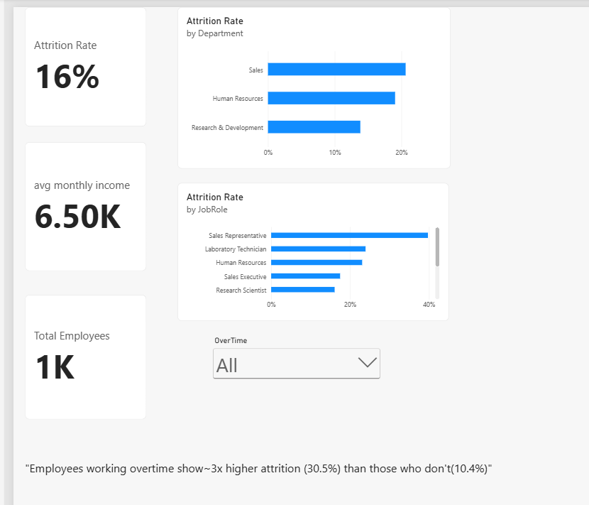

# HR Employee Attrition Analysis

Power BI dashboard analyzing employee attrition patterns using the IBM HR Analytics Employee Attrition dataset (Kaggle).

## What I Analyzed
- Overall attrition rate across the organization
- Attrition rate by department and job role
- Impact of overtime on employee attrition

## Key Finding
Employees working overtime show ~3x higher attrition (30.5%) compared to those who don't (10.4%) — suggesting workload management could be a meaningful lever for reducing turnover.

## Dashboard

## Tools Used
Power BI, DAX, Power Query
